# REW Workplace — Cross-Functional Flowchart (Mermaid.js)

> เวอร์ชัน Mermaid ของ `WORKFLOW_FLOWCHART.txt` แปลงเพื่อดูใน VS Code
> วิธีดู: ติดตั้ง extension **Markdown Preview Mermaid Support** (bierner.markdown-mermaid)
> แล้วเปิดไฟล์นี้ กด `Ctrl+Shift+V` (Open Preview)

**Legend (lanes):** Employee = พนักงาน · Approver = ผู้อนุมัติ · Admin = ผู้ดูแลระบบ ·
Device = Browser API · UI = Component layer (`js/components/*.js`) ·
Service = Business logic (`js/services/*.js`) · Data = Data layer (`js/data/*.js` + localStorage)

สถาปัตยกรรม: client-side ล้วน ไม่มี backend, ข้อมูลส่วนใหญ่เป็น in-memory
(หายเมื่อ refresh) ยกเว้น session ที่ persist ผ่าน `localStorage["rewworkplace_session"]`

---

## 1. App Bootstrap & Session Restore

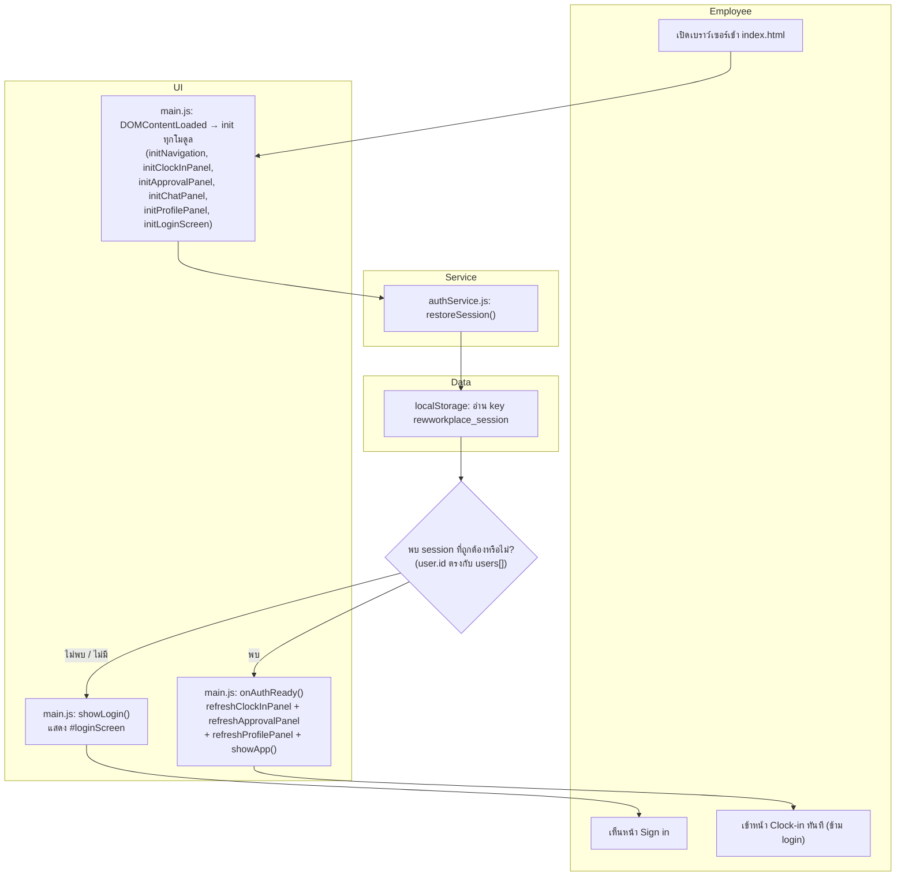

---

## 2. Login

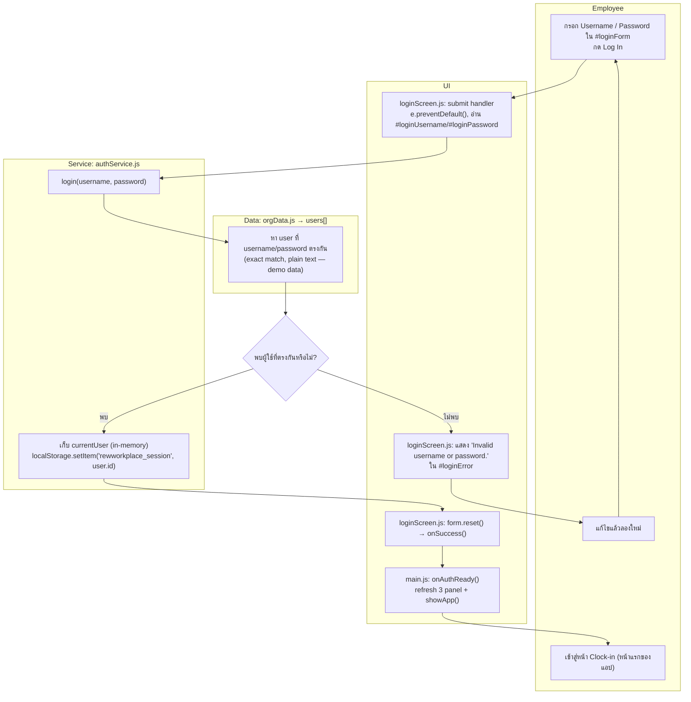

> หมายเหตุ: บัญชีทดสอบ (password: `1234` ทุกบัญชี) — aran, suda, kittipong, siriporn, pranee, somchai, anan

---

## 3. Clock In / Clock Out (พร้อมตรวจสอบพิกัด GPS)

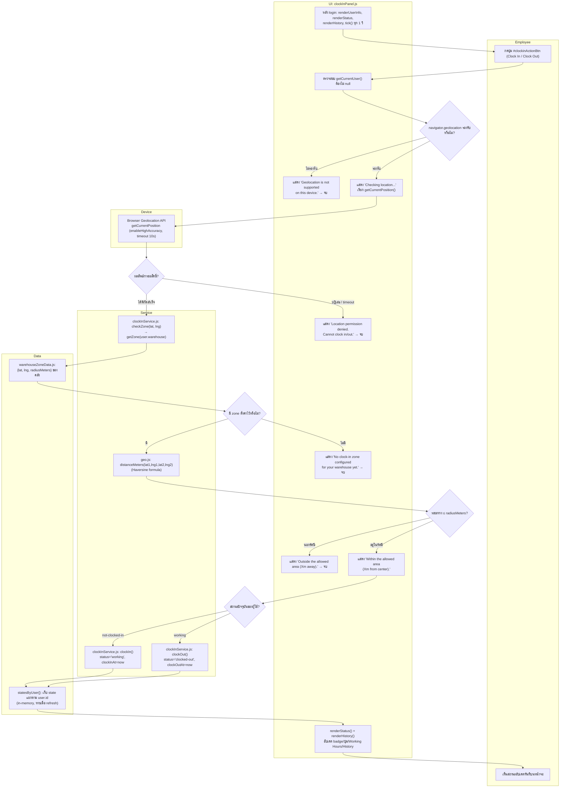

> หมายเหตุ: ปุ่ม Clock Out กดซ้ำไม่ได้เมื่อสถานะเป็น `clocked-out` (disabled) —
> ไม่มี flow ให้ Clock In ซ้ำในวันเดียวกันในโค้ดปัจจุบัน

---

## 4. Chat — เปิดแชทและส่งข้อความ

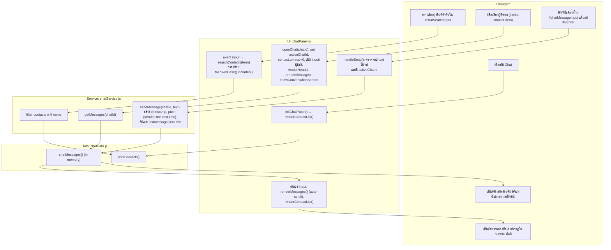

> หมายเหตุ: demo ฝั่งเดียว — ไม่มีฝั่งคู่สนทนาโต้ตอบกลับจริง (ข้อความ "them" มีอยู่แล้วล่วงหน้าใน chatData.js เท่านั้น)

---

## 5. Approval — พนักงานสร้างคำขอ (Request OT / Request Item)

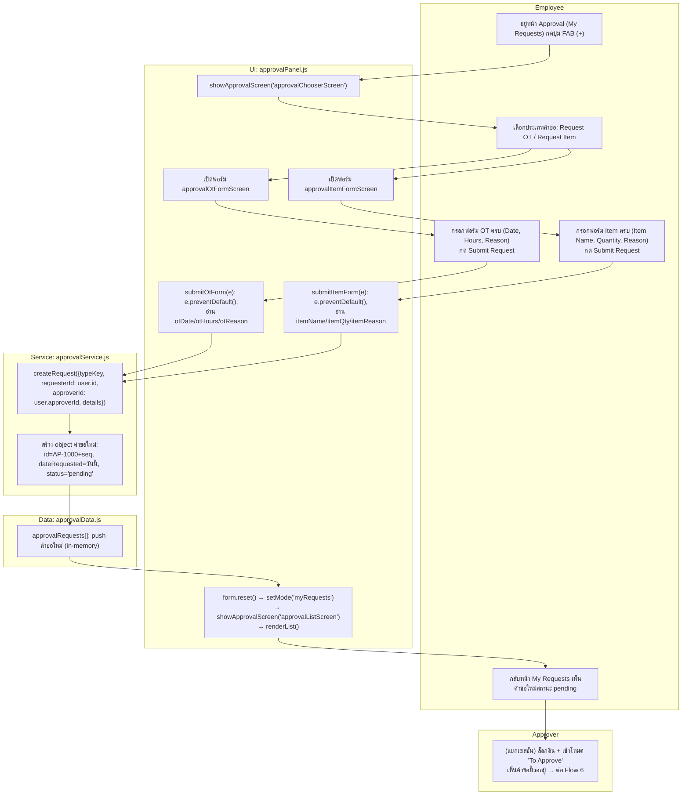

> หมายเหตุ: `approverId` มาจาก `user.approverId` ที่ตั้งไว้ล่วงหน้าใน Admin > Organization (Flow 8) — ระบบไม่ได้ให้ผู้ใช้เลือกผู้อนุมัติเอง

---

## 6. Approval — ผู้อนุมัติพิจารณาคำขอ (Approve / Reject)

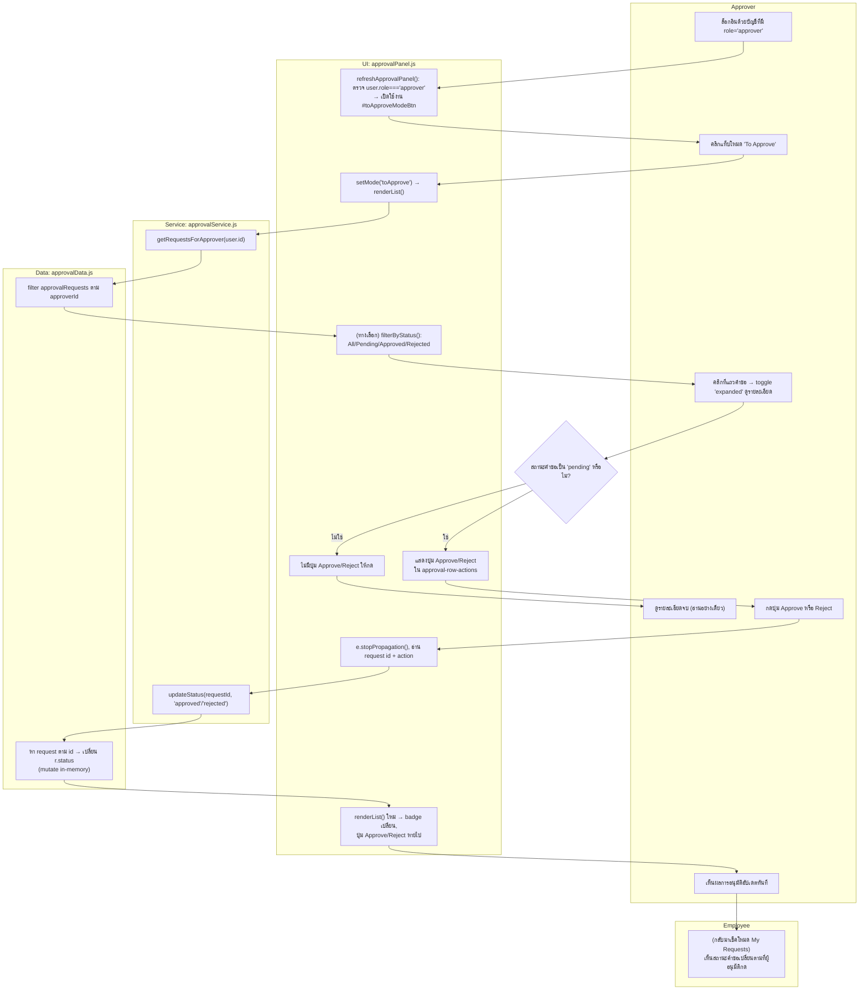

> หมายเหตุสำคัญ: mutate array ใน memory ของแท็บเบราว์เซอร์เดียวกันเท่านั้น ไม่มีการซิงค์ข้ามอุปกรณ์/ผู้ใช้จริง (ไม่มี backend)

---

## 7. Profile — ดูและแก้ไขโปรไฟล์ (รวมเปลี่ยนรูป)

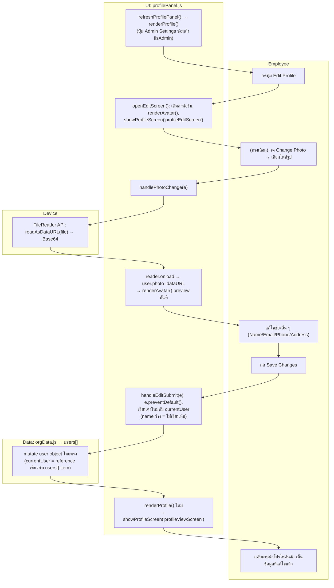

---

## 8. Admin — ตั้งค่า Organization (ตำแหน่ง / คลัง / สายอนุมัติ)

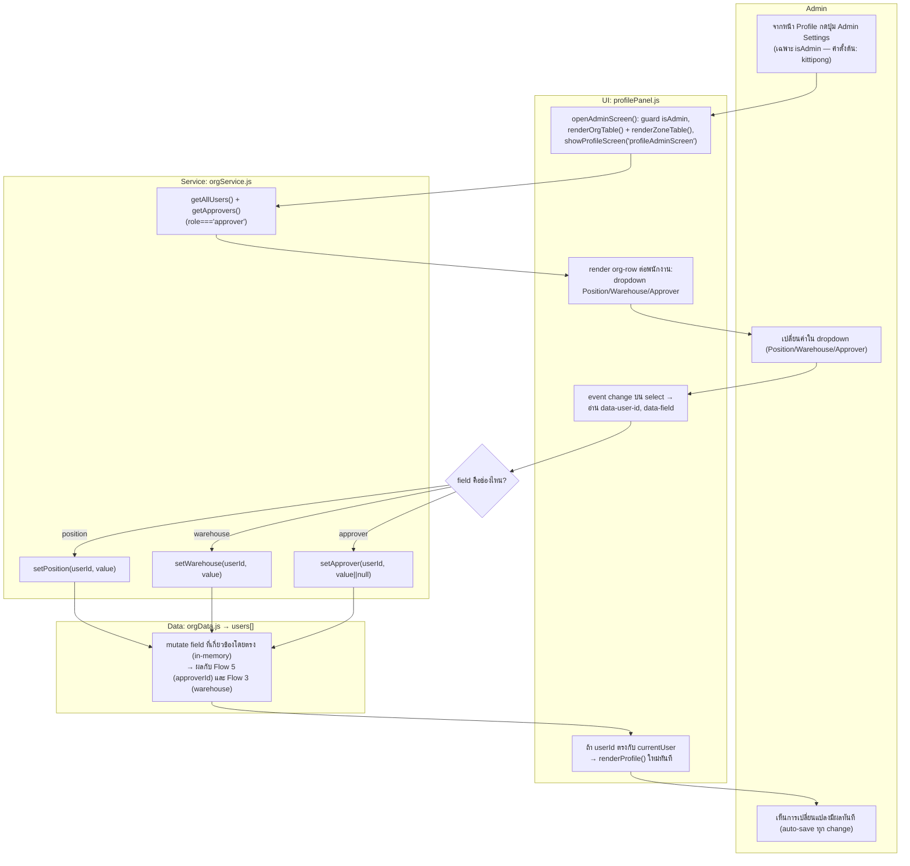

---

## 9. Admin — ตั้งค่า Clock-in Zone (พิกัด GPS และรัศมี)

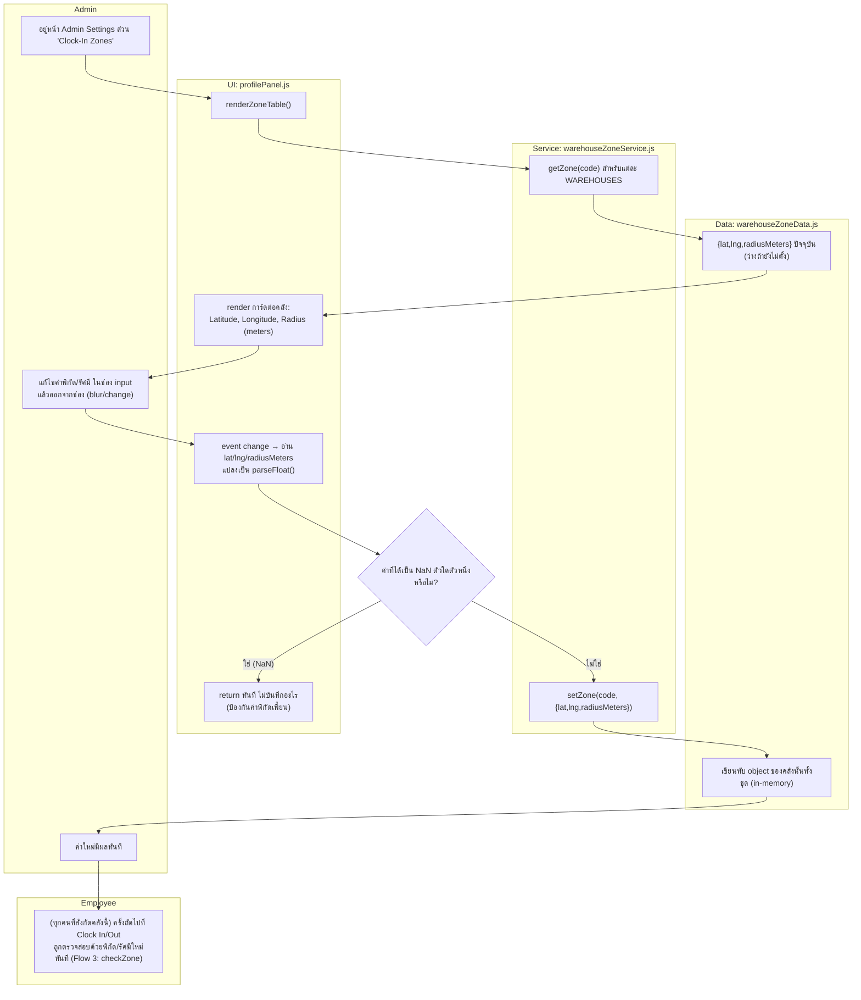

---

## 10. Logout

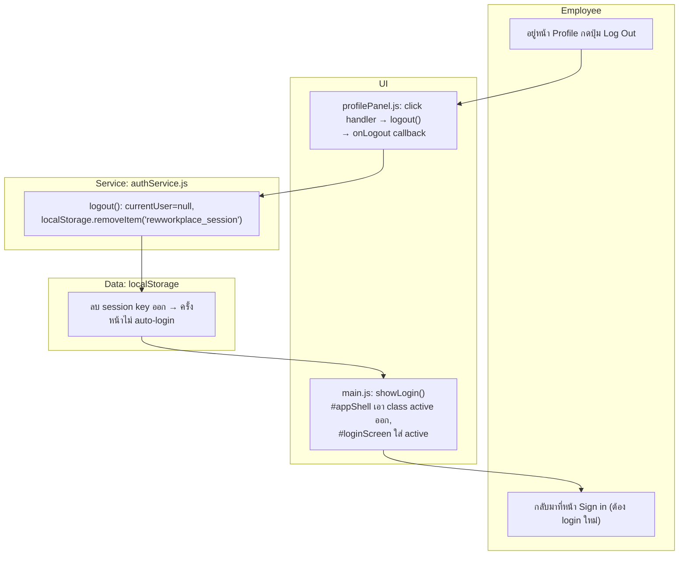

> หมายเหตุ: state อื่น ๆ ที่เป็น in-memory (clock-in status, ข้อความแชท, คำขออนุมัติใหม่) ยังคงอยู่จนกว่าจะ refresh หน้า — ไม่ถูกล้างตอน logout

---

## 11. Bottom Navigation (การสลับหน้าจอหลัก)

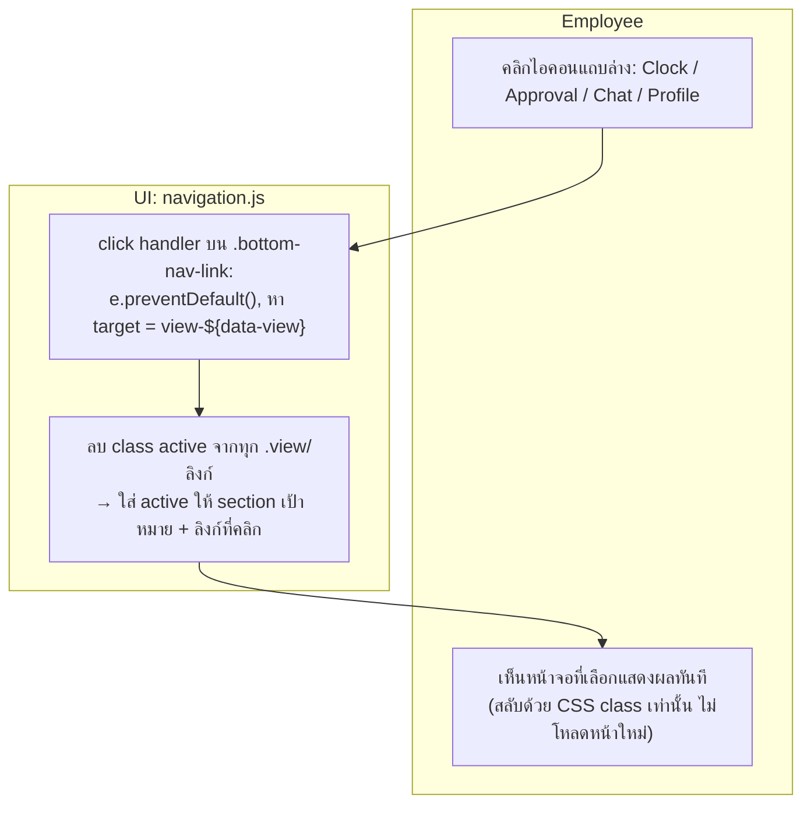

---

## สรุปความสัมพันธ์ระหว่าง Flow (Cross-Flow Dependencies)

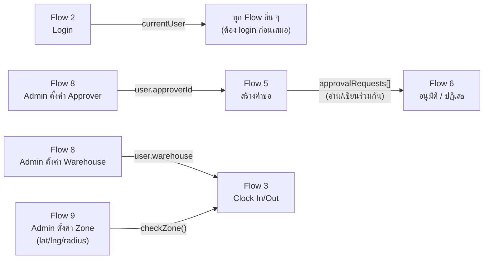
